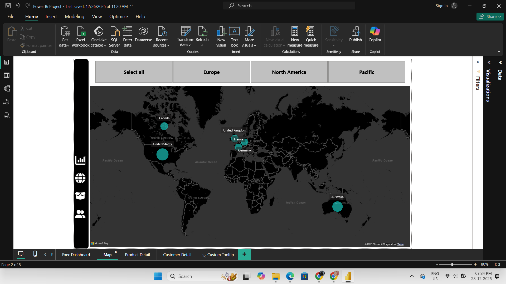

# Power BI Sales Dashboard

## Project Overview
This project analyzes sales data using Power BI to identify trends, performance, and actionable business insights.

## Tools Used
- Power BI
- Excel
- SQL

## Dashboard Features
- Total Sales & Profit analysis
- Category-wise performance
- Region-wise sales insights
- Monthly sales trends
- Interactive filters and visuals

## Files Included
- `Power Bi Project.pbix` – Power BI report file  
- `AdventureWorks Raw Data` – Source dataset  
- `Dashboard.png/` – Dashboard screenshots  
- `Dashboard.pdf` – Exported report (PDF)

## How to Use
1. Download the `.pbix` file  
2. Open it using **Power BI Desktop**  
3. Refresh data if required  

## Dashboard Preview

### Main Dashboard

### Product Details

### Sales Map

### Customer Details

## Author
**Wince S**
